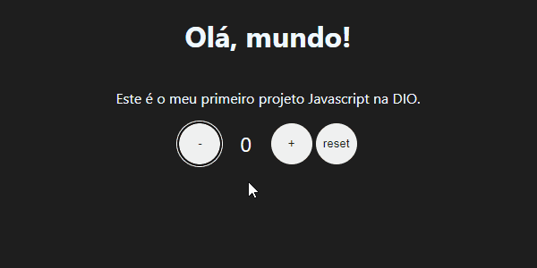

<h2 align="center">Sumário</h2>

    <a href="#about">📙 About</a>
    <a href="#certificados">📜 Certificados</a>
    <a href="#js">💡 Desafios Js</a>
    

<!-- 600x300 -->
 <h3 id='js'>1# Desafio - Introdução ao JavaScript</h3>

## Contador

- Tente implementar os eventos usando o método addEventListener.

- Crie condicionais que desabilitam o botão de incrementar ou decrementar quando count chegar a um determinado valor (ex.: 0 <= count =< 10).

- Mude a cor do texto em CURRENT_NUMBER para vermelho quando o número for negativo.

</img>

<h3>2# Desafio - Introdução ao JavaScript</h3>

## To-do list

- Crie um campo de input de texto e um botão para adicionar a tarefa à lista.
 
- Quando o botão for pressionado, o texto deve aparecer na lista com um checkbox ao lado.
 
- Quando o usuário selecionar o checkbox, o item correspondente deve ficar com o texto riscado. (ex.: tarefa completa. dica: você pode resolver isso facilmente com CSS).

</img>

<h2 id='certificados'>📜Certificados</h2>

</img>
</img>
</img>
</img>
</img>
</img>
</img>
</img>
</img>
</img>
</img>
</img>
</img>

